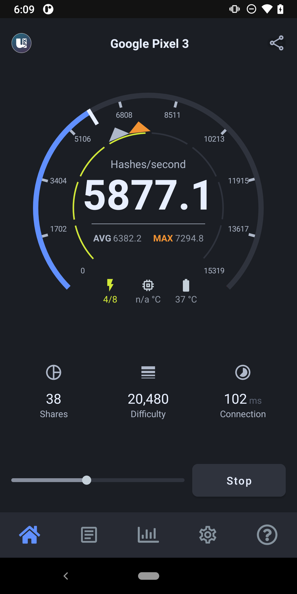

WAZN Android Miner
======================

[](https://opensource.org/licenses/GPL-3.0)

A high performance and open-source application for mining Wazn on Android mobile devices.

	&nbsp;	&nbsp;	&nbsp;	&nbsp;	

## Supported CPU instruction sets
- **armeabi-v7a**
- **arm64-v8a**

## Usage

Miner application will work on devices with ARM64 architecture.

Install and run the app, enter your Wazn wallet address, press start button to initiate mining or press stop to suspend mining.  
Connections are available through [wazn-proxy](https://github.com/project-wazn/wazn-proxy) and mining is made on a server running [wazn-nodejs-pool](https://github.com/project-wazn/wazn-nodejs-pool).

## Notes

The waznrig binary is copied to the app's internal directory along with its dependent libraries as it can only be executed from that location.

The binary is started using the ProcessBuilder class, and the output is captured into the application scrolling pane once each second.

Currently only arm64 binaries are included, and the app will refuse to work on other architectures like x86 or 32 bit devices.

## License
```
Licensed under the GPL-3.0
Copyright (c) 2019-2021 Wazn Project
Copyright (c) 2019 uPlexa
Copyright (c) 2017-2019 xmrig
```
